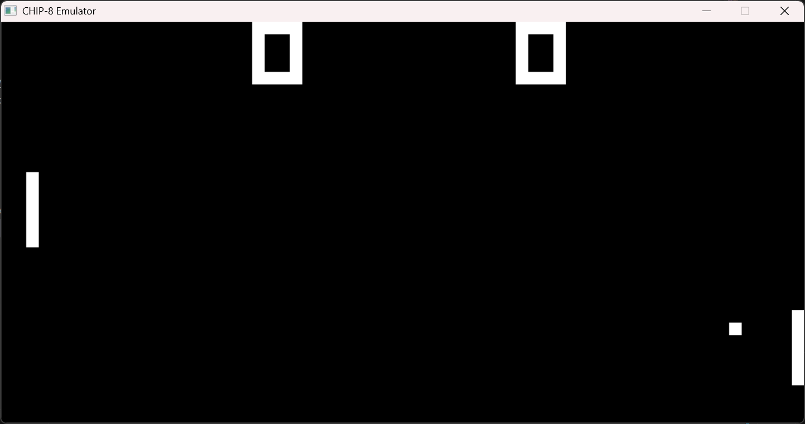

# CHIP-8 Emulator

## Overview
CHIP-8 is a simple interpreted programming language used in vintage computer systems.

This project implements a CHIP-8 emulator capable of loading and executing classic ROMs like Pong and Tetris by emulating the CPU, memory, display, timers, and keypad input.

## 🎮Features
- Opcode decoding and execution
- 4KB memory emulation
- 64x32 monochrome display rendering using SDL
- Hex keypad input handling
- Delay and sound timers
- ROM loading and execution

## 🛠How to Build

1. Install CMake and a C++ compiler (MinGW / GCC).
2. Open terminal in project folder.

mkdir build
cd build
cmake ..
cmake --build .

## How to Run

Run the emulator with a ROM file:

./chip8 path/to/rom.ch8

Example:

./chip8 ../roms/pong.ch8

## Controls

Original CHIP-8 keypad:

1 2 3 C
4 5 6 D
7 8 9 E
A 0 B F

Keyboard mapping:

1 2 3 4
Q W E R
A S D F
Z X C V

## Project Structure

chip-8/
├── include/      → header files
├── src/          → emulator source code
├── roms/         → test ROMs
├── vendor/       → external libraries
└── CMakeLists.txt

## Learning Outcomes
This project demonstrates:
- Low-level system emulation
- Opcode decoding & CPU architecture understanding
- Memory and stack management
- Graphics rendering using SDL
- Event-driven input handling

## Demo

