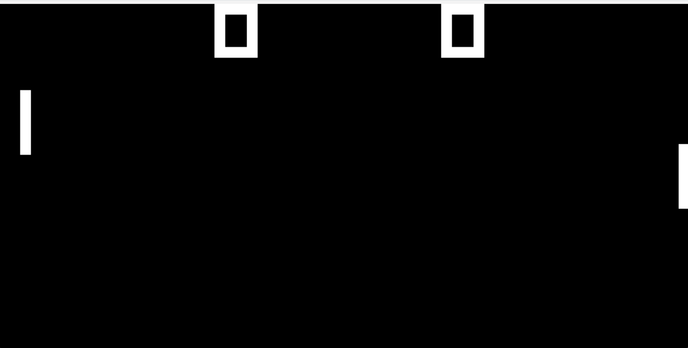

# 🎮 CHIP-8 Emulator

## 🧠 Overview

This project is a **CHIP-8 Emulator** built in **C++ using SDL2**.

It recreates the CHIP-8 virtual machine by implementing:

- 🧩 Instruction decoding & execution  
- 🧠 Memory and stack management  
- 🖥️ Graphics rendering (64×32 display)  
- ⌨️ Keyboard input handling  
- 📂 ROM loading and execution  

The emulator can run classic CHIP-8 games like **Pong, Space Invaders, and Tetris**.

---

## ✨ Features

- ✅ 35 CHIP-8 opcodes implemented  
- 🎯 Accurate 64×32 monochrome display rendering  
- ⌨️ Real-time keyboard input mapping  
- ⚡ Adjustable execution speed  
- 🧱 Cross-platform build with CMake  
- 🖼️ SDL2-based graphics output  

---

## 🛠️ Build Instructions

### Requirements
- CMake  
- C++ Compiler (MinGW / GCC / Clang)  
- SDL2 (included in `vendor/`)

### Steps

```bash
mkdir build
cd build
cmake ..
cmake --build .
```

---

## ▶️ Running the Emulator

Run the emulator from the **build** directory.

### 🪟 Windows
```bash
.\chip8.exe <speed> <scale> "..\roms\game.ch8"
```

**Example**
```bash
.\chip8.exe 15 2 "..\roms\Pong (1 player).ch8"
```

### 🐧 Linux / macOS
```bash
./chip8 <speed> <scale> ../roms/game.ch8
```

### Arguments

- **speed** → CPU execution speed (higher = faster gameplay)  
- **scale** → window size multiplier  

### Example

```bash
./chip8 ../roms/pong.ch8
```

---

## 🎮 Controls

### Original CHIP-8 Keypad

```
1 2 3 C
4 5 6 D
7 8 9 E
A 0 B F
```

### Keyboard Mapping

```
1 2 3 4
Q W E R
A S D F
Z X C V
```

---

## 📁 Project Structure

```
chip-8/
├── roms/          → test ROMs (Pong, Space Invaders, Tetris)
├── vendor/        → SDL2 library & dependencies
├── chip8.cpp      → emulator core & opcode implementation
├── chip8.h
├── main.cpp       → program entry & execution loop
├── platform.h     → SDL window, rendering & input handling
├── CMakeLists.txt → build configuration
└── README.md
```

---

## 🎥 Demo

<p align="center">
  
</p>


## 🧠 Learning Outcomes

This project demonstrates:

- Low-level system emulation  
- Opcode decoding & CPU architecture understanding  
- Memory and stack management  
- Graphics rendering using SDL  
- Event-driven input handling  

---

## ▶️ Run Example (Windows)

From the build directory:

```bash
.\chip8.exe 15 2 "..\roms\Pong (1 player).ch8"
```

---

## 🎮 Supported ROMs

- 🟢 Pong  
- 👾 Space Invaders  
- 🧱 Tetris  

---

⭐ If you found this project interesting, consider starring the repo!
